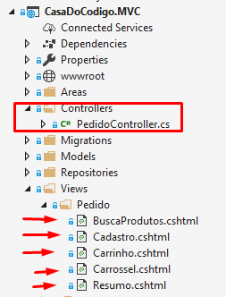
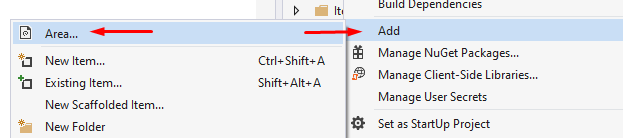
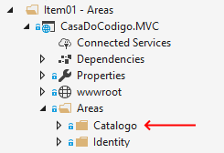
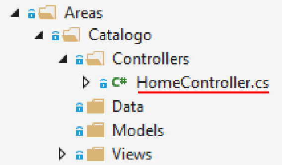
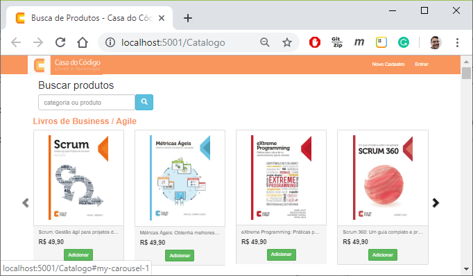

# ASP.NET Core Parte 5
## Modularização e Componentização

### Introdução

A programação modular é um dos padrões de design, que divide os projetos em vários módulos com base em recursos e considera os módulos como projetos separados.

Neste curso abordaremos um Projeto Inicial de uma aplicação de comércio eletrônico, que passará por um processo progressivo de modularização e componentização. Iremos aprender a criar Áreas, Views Parciais, Componentes Visuais e Isolamento de Contextos e de modelos.

# 1) Areas

## Vídeo 1.1: Modularização com ASP.NET Core

#### O Projeto Inicial

Para começar este curso, trabalharemos com um projeto de loja virtual da editora Casa do Código. Esse projeto contém as funcionalidades:

1. login/registro de novo usuário 
2. catálogo de produtos
3. carrinho de compras
4. cadastro de usuário
5. checkout (fechamento de pedido)

O projeto inicial funciona perfeitamente. Porém, quando olhamos a estrutura do projeto, notamos apenas 1 controller para lidar com toda a aplicação. Além disso, todas as views estão misturadas numa mesma pasta do projeto:



Da mesma forma, os modelos também estão misturados na mesma pasta Models:


Claramente, nosso projeto carece de uma boa organização, e sem ela pode ser mais difícil desenvolver novas funcionalidades. Essa falta de organização dificulta futuras mudanças e expansões no projeto, pois não existe nenhum módulo ou separação clara entre as diferentes áreas da aplicação

#### Nova área: Catalogo

Para melhorar a organização do código, o ASP.NET Core possui o conceito de **Area**. Áreas são um recurso do ASP.NET Core usado para organizar funcionalidades relacionadas em um grupo. 
Vamos demonstrar a criação de uma nova área em nosso projeto através de um processo de ***scaffolding***. Essa área vai conter as funcionalidades do catálogo de produtos.

Para criar uma nova área, clique com o botão direito sobre o nome do projeto, e escolha ***Add > Area***:



A seguir, preencha o nome da área "Catalogo".


Pronto, agora temos uma nova subpasta **Catalogo** dentro da pasta **Areas**.



Agora temos novas pastas no projeto, que podem ser usadas na organização e modularização da aplicação:

- Areas
	- Catalogo
     	- Controllers
       	- Data
       	- Models
       	- Views


#### Benefícios da programação modular

Você pode ter percebido que essas pastas sugerem que os controllers, modelos, views e dados de catálogo sejam mantidos de forma isolada em relação ao resto da aplicação. Vamos fazer essas mudanças progressivamente ao longo deste curso.

Vejamos os benefícios da programação modular:

- Desenvolvimento rápido
  - Trabalhar em todos os módulos simultaneamente por diferentes equipes ou membros reduzirá o tempo de conclusão.
- A base de código facilmente gerenciável
  - Codebase será gerenciado sem qualquer aborrecimento.
- Solução de problemas fácil
  - A resolução de problemas será mais propícia, uma vez que é fornecida uma base de código separada para cada módulo.
- Responsabilidade definida pelas equipes / membros
  - Cada equipe ou membro terá uma responsabilidade precisamente predefinida no projeto.

## Vídeo 1.2 Controller e Roteamento de Área

A área Catalogo conterá modelos, views e controllers específicos do catálogo de produtos da aplicação.

Vamos começar criando um novo controller dentro da area de Catalogo:



A seguir, copiamos o método `BuscaProdutos()` da classe `PedidoController` para a nova classe `HomeController`, e o renomeamos como `Index()`:


```csharp
[Area("Catalogo")]
public class HomeController : Controller
{
    // GET: /<controller>/
    public async Task<IActionResult> Index(string pesquisa)
    {
        return View(await produtoRepository.GetProdutosAsync(pesquisa));
    }
}
```

Porém, o novo método `Index` acima depende de `produtoRepository`, que não existe na classe. Vamos fornecê-lo por injeção de dependência, que será armazenado em um campo privado no construtor da classe:


```csharp
public class HomeController : Controller
{
    private readonly IProdutoRepository produtoRepository;

    public HomeController(IProdutoRepository produtoRepository)
    {
        this.produtoRepository = produtoRepository;
    }
.
.
.
}
```

Agora precisamos definir o `HomeController` como destino de uma nova **rota de área**. Ou seja, sempre que o usuário navegar para **localhost:5101/Catalogo**, ele deverá acessar a action `Index` de `HomeController` dentro da pasta **Areas/Catalogo**. 

Faremos isso 1) decorando o controller com um atributo e também 2) definindo uma rota de área em **Startup.cs**.

1) Vamos decorar o controller com um atributo AreaAttribute. Esse atributo permite que o HomeController esteja acessível para a rota de área de Catalogo.

```csharp
[Area("Catalogo")]
public class HomeController : Controller
```

2) Vamos Adicionar uma rota de área em **Startup.cs** com o método `MapAreaRoute`:

**Startup.cs (código original)**
```csharp
app.UseMvc(routes =>
{
    routes.MapRoute(
        name: "default",
        template: "{controller=Pedido}/{action=BuscaProdutos}/{codigo?}");
});
```

O código a seguir usa MapAreaRoute para criar uma rota de área nomeadas:

**Startup.cs (código alterado)**
```csharp
app.UseMvc(routes =>
{
	//criando o mapeamento de rota para a área de catálogo
    routes.MapAreaRoute(
        name: "AreaCatalogo",
        areaName: "Catalogo",
        template: "Catalogo/{controller=Home}/{action=Index}/{pesquisa?}");

    routes.MapRoute(
        name: "default",
        template: "{controller=Pedido}/{action=BuscaProdutos}/{codigo?}");
});
```

O método `MapAreaRoute` acima adiciona uma rota ao `IRouteBuilder` com a área MVC especificada com o nome, areaName e template especificados.

Graças a esse roteamento de área de catálogo, sempre que o usuário navegar para **localhost:5101/Catalogo**, ele irá acessar a action `Index` de `HomeController` dentro da pasta **Areas/Catalogo**.

Como já movemos o método `BuscaProdutos()` para o novo controller `HomeController` (renomeado como `Index()`), iremos remover o método original de `PedidoController`:

***Arquivo: PedidoController.cs***

**Remover o método:**
```csharp
public async Task<IActionResult> BuscaProdutos(string pesquisa)
{
    return View(await produtoRepository.GetProdutosAsync(pesquisa));
}
```

Por outro lado, precisamos garantir que, sempre que o usuário acesse a rota default **localhost:5101/** (sem área), devemos redirecionar o usuário para a tela de busca de produtos, isto é, para o endereço **localhost:5101/Catalogo/Home/Index**. Vamos implementar o `HomeController` na pasta default **Controllers**: 

***Arquivo: \Controllers\HomeController.cs***

```csharp
    public class HomeController : Controller
    {
        // GET: /<controller>/
        public IActionResult Index()
        {
            return Redirect("/Catalogo");
        }
    }
```

O método Redirect acima cria um objeto `RedirectResult` que redireciona para a URL "/Catalogo" da área de catálogo, usando o método HTTP 302 (redirect).



### Vídeo 1.3 Correção de links para nova área de catálogo

Como estamos realizando mudanças na estrutura de pastas do projeto e no mecanismo de roteamento da aplicação MVC, isso afetará os links e endereços preexistentes em nosso website.

Precisamos identificar os pontos afetados e corrigir os endereçamentos de rota para que a aplicação continue funcionando normalmente.

Que pontos são esses?

Em primeiro lugar, vamos corrigir o link para a home page do website. Esse link está localizado no logotipo da Casa do Código, mais precisamente no arquivo _Layout.cshtml:

***arquivo: Views/Shared/_Layout.cshtml***

```razor
<a asp-controller="Pedido" asp-action="BuscaProdutos" class="navbar-brand"></a>
```

Aqui, vamos remover os atributos asp-controller e asp-action, adicionando o atributo asp-area com o nome da área catalogo:

```razor
<a asp-area="catalogo" class="navbar-brand"></a>
```

Mas e quanto aos atributos asp-controller e asp-action? Como eles não são mencionados, são assumidos seus valores default: `Home` e `Index`, respectivamente. No final, esse link irá direcionar o usuário para o endereço **localhost:5101/cadastro/home/index**, que devolve a página de busca de produtos. 


Seguindo a mesma lógica, vamos corrigir o link da *partial view* **Views/Shared/_LoginPartial.cshtml**:

**antes:**

<form asp-area="Identity" asp-page="/Account/Logout" asp-route-returnUrl="@Url.Page("/Index", new { area = "" })" method="post" id="logoutForm" class="navbar-right">

**depois:**

<form asp-area="Identity" asp-page="/Account/Logout" asp-route-returnUrl="@Url.Page("/", new { area = "Catalog" })" method="post" id="logoutForm" class="navbar-right"> 

Note que o método `Url.Page` acima agora referencia a área Catalogo.

As próximas alterações corrigem a view de busca de produtos (que chamamos de /Catalogo/Home/Index.cshtml):

***arquivo \Catalogo\Views\Home\Index.cshtml***

Vamos adicionar a diretiva `addTagHelper`, que habilita o uso de tag helpers no código razor. Vamos também adicionar o namespace do viewmodel `BuscaProdutosViewModel` que é usado pela view como modelo:

```Razor
@addTagHelper *, Microsoft.AspNetCore.Mvc.TagHelpers
@using CasaDoCodigo.Models.ViewModels;
```

Continuando na mesma view, trocamos o atributo asp-action por um atributo asp-area apontando para a área de catálogo:

**antes:**

```Razor
<form asp-action="buscaprodutos">
```

**depois**

```Razor
<form asp-area="Catalogo">
```

Ainda falta corrigir um link na view de catálogo: aqui, a action de carrinho não tem nenhuma indicação de área. Por isso, precisamos dizer que essa action está numa área "vazia", e no controller `PedidoController`:

**antes**
```razor
	<a asp-action="carrinho"
```

**depois**
```razor
	<a asp-area=""                  
	asp-controller="pedido"
	asp-action="carrinho"
```

A seguir, as outras views também precisam apontar o link para o catálogo mencionando o atributo de área. 

Vamos fazer essa alteração nas views:

- **Cadastro**
- **Carrinho**
- **Resumo**

***arquivo Views\Cadastro.cshtml***

**antes**

```razor
<a class="btn btn-success" asp-action="buscaprodutos">
```

**depois**

```razor
<a class="btn btn-success" asp-area="Catalogo">
```


***arquivo Views\Carrinho.cshtml***
**antes**
```razor
<a class="btn btn-success" asp-action="buscaprodutos">
```

**depois**
```razor
<a class="btn btn-success" asp-area="Catalogo">
```

**antes**
```razor
<a class="btn btn-success" asp-action="buscaprodutos">
```

**depois**
```razor
<a class="btn btn-success" asp-area="Catalogo">
```

***arquivo Views\Resumo.cshtml***

**antes**
```razor
<a class="btn btn-success" asp-action="buscaprodutos">
```
**depois**
```razor
<a class="btn btn-success" asp-area="Catalogo">
```

Com essas alterações finais, nossa aplicação voltou a funcionar normalmente como antes. A diferença é que conseguimos organizar e modularizar a área de Catálogo. Você também pode criar as outras áreas do projeto dessa forma (ex.: Carrinho, Cadastro, Resumo, Pedido), deixando a aplicação organizada por grupo de funcionalidades.


### Nova área: Carrinho
### Nova área: Cadastro


### Partial Views

Partial views
More Partial Views

### View Components

View Components

### Isolando Contextos

Isolando Contextos

### Modelos Delimitados

Modelos Delimitados

Pós-vídeo: removendo produto e categoria do contexto principal da apl… 

### Conclusão


