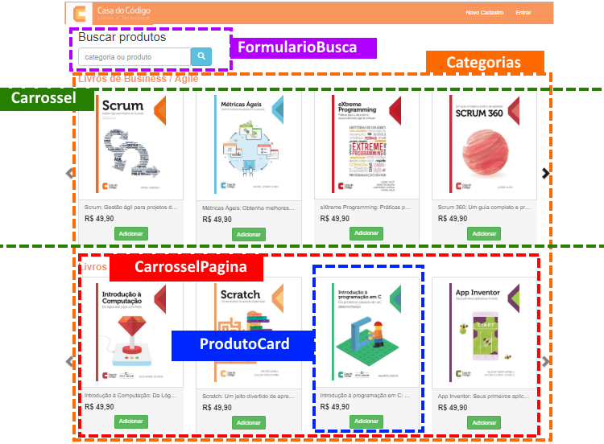
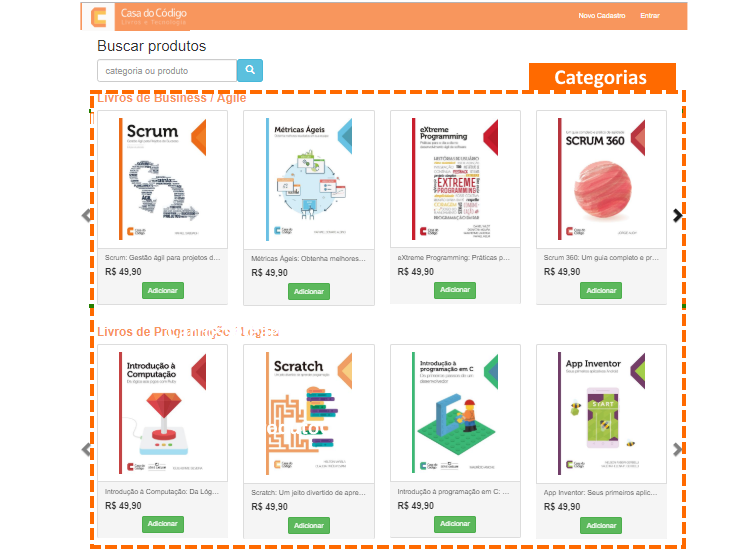
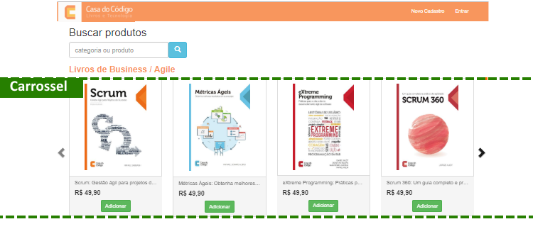
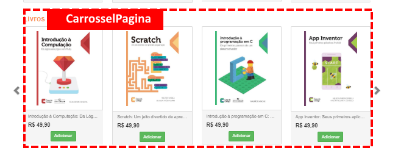

# 3) View Components

## Vídeo 3.1. Criando o Primeiro View Component

Na última aula, aprendemos sobre as partial views, e como elas podem ser usadas para organizar melhor o código razor das páginas e facilitar a leitura e compreensão das views.

Ainda existem vários outros trechos de views da aplicação da Casa do Código que podem ser "quebrados" em arquivos menores, além daqueles que já criamos. Mas em vez de criarmos novas views parciais, vamos abordar uma nova técnica alternativa. Nesta aula, vamos aprender sobre um novo tipo de elemento fornecido pelo ASP.NET Core para organização e componentização de interfaces da aplicação: os Componentes de Exibição, ou ViewComponents.

Os ViewComponents são semelhantes às partial views. Eles dão um pouco mais de trabalho para serem criados, mas são muito mais eficientes. Agora vamos demonstrar a criação de um ViewComponent para a view do catálogo de produtos.

Vamos identificar na view de Catálogo onde estão os elementos que podem ser extraídos para novos componentes:



## ViewComponent: Categorias

Nossa primeira "cobaia" para esta aula sobre ViewComponents é a view principal da área de catálogo:



*** arquivo: \Areas\Catalogo\Views\Home\Index.cshtml***

```csharp
@{
    var produtos = Model.Produtos;

    var categorias =
        produtos
            .Select(m => m.Categoria)
            .Distinct();
}

@foreach (var categoria in categorias)
{
    var produtosNaCategoria =
        produtos
        .Where(p => p.Categoria.Id == categoria.Id);

    <h3>@categoria.Nome</h3>

    <div id="my-carousel-@categoria.Id" class="carousel slide" data-ride="carousel">
        <!-- Wrapper for slides -->
        <div class="carousel-inner" role="listbox">
            @{
                const int TAMANHO_PAGINA = 4;

                int paginas = (int)Math.Ceiling((double)produtosNaCategoria.Count() / TAMANHO_PAGINA);
            }
            @for (int pagina = 0; pagina < paginas; pagina++)
            {
                <div class="item @(pagina == 0 ? "active" : "")">
                    <div class="row">
                        @{
                            var produtosDaPagina = produtosNaCategoria.Skip(pagina * TAMANHO_PAGINA).Take(TAMANHO_PAGINA);
                        }
                        @foreach (var produto in produtosDaPagina)
                        {
                            <partial name="_ProdutoCard" model="@produto" />
                        }
                    </div>
                </div>

            }
        </div>
        <!-- Controls -->
        <partial name="_NavegacaoCarrossel" model="@categoria" />
    </div>
}
```

Como podemos perceber, essa view é bastante complexa. Ela contém:

- O código C# para obter as categorias distintas a partir da lista de produtos
- Um laço `foreach` para percorrer as categorias de produtos
- Uma consulta para obter os produtos de uma determinada categoria
- O código HTML para exibir o carrossel de produtos da uma categoria
- O código C# para obter os produtos da categoria com paginação
- O código C# para percorrer as páginas de produtos
- O código HTML para varrer a lista de produtos e exibir os cards de produtos

Vamos "quebrar" então essa view em diversas partes, começando com o elemento mais "externo", que é o que renderiza as categorias de produtos. Esse trecho que exibe categorias será extraído para um novo componente de exibição (View Component) chamado `CategoriasViewComponent`.

O View Component `CategoriasViewComponent` consistirá de três arquivos: 

1. a classe de component (normalmente derivada de ViewComponent) ,
2. a classe ViewModel contendo o modelo dedicado a esse ViewComponent
3. o documento razor que o componente retorna.

Assim como os controllers, um View Component pode ser uma classe simples em C#, mas você irá aproveitar melhor os métodos e as propriedades disponíveis com uma subclasse herdada da classe `ViewComponent`.


### 1) a classe do ViewComponent

O novo arquivo CategoriasViewComponent conterá o código C# para obter as categorias distintas a partir da lista de produtos:

*** arquivo: \Areas\Catalogo\ViewComponents\CategoriasViewComponent.cs***

```csharp
public class CategoriasViewComponent : ViewComponent
{
    const int TamanhoPagina = 4;
    public CategoriasViewComponent()
    {
    }

    public IViewComponentResult Invoke(List<Produto> produtos)
    {
        var categorias = produtos
            .Select(p => p.Categoria)
            .Distinct()
            .ToList();
        return View("Default", new CategoriasViewModel(categorias, produtos, TamanhoPagina));
    }
}
```

### 2) a classe ViewModel 

Essa classe contém o modelo dedicado ao ViewComponent e transportará os dados de categorias e produtos

*** arquivo: \Areas\Catalogo\Models\ViewModels\CategoriasViewModel.cs***

```csharp
public class CategoriasViewModel
{
    public CategoriasViewModel()
    {

    }

    public CategoriasViewModel(List<Categoria> categorias, List<Produto> produtos, int tamanhoPagina)
    {
        Categorias = categorias;
        Produtos = produtos;
        TamanhoPagina = tamanhoPagina;
    }

    public List<Categoria> Categorias { get; set; }
    public List<Produto> Produtos { get; set; }
    public int TamanhoPagina { get; set; }
}
```

### 3) o documento razor 

O novo arquivo cshtml não terá nenhum código C# além do necessário para percorrer a lista de categorias. O restante do arquivo será composto de código HTML ou razor.

*** arquivo: \Areas\Catalogo\Views\Home\Components\Categorias\Default.cshtml***

```csharp
@using CasaDoCodigo.Areas.Catalogo.Models.ViewModels;
@addTagHelper *, CasaDoCodigo.MVC
@model CategoriasViewModel

<div class="container">
    @foreach (var categoria in Model.Categorias)
    {
        <!--AQUI VAI O CÓDIGO EXTRAÍDO DA VIEW PRINCIPAL DE CATÁLOGO-->
    }
</div>
```

### 4) tag helper de ViewCompoment

Agora precisamos substituir o código extraído da view principal por uma tag helper que referencia o novo ViewComponent de categorias:

Vamos extrair esse trecho acima para um novo componente, que chamaremos de **"Categorias"**. Esse arquivo será salvo em \Areas\Catalogo\Views\Home\Components\Categorias\Default.cshtml.

ADICIONAR:

```razor
<vc:categorias produtos="@Model.Produtos"></vc:categorias>
```

Note que no trecho acima não estamos passando um atributo "model", mas sim um parâmetro customizado chamado "produtos". Isso acontece porque os ViewComponents não usam o "model binding" e dependem apenas dos dados que fornecemos a eles.


## Vídeo 3.2. ViewComponents Com Múltiplos Parâmetros

## ViewComponent: Carrossel



O ViewComponent de categorias (`CategoriasViewComponent`) exibe um conjunto de carrosséis de produtos. Cada carrossel exibe todos os produtos da categoria em questão. O código razor desse carrossel será extraído para um novo componente de exibição (View Component) chamado `CarrosselViewComponent`.


*** arquivo: \Areas\Catalogo\Views\Home\Components\Carrossel\Default.cshtml***

```csharp
@using CasaDoCodigo.Areas.Catalogo.Models.ViewModels;
@addTagHelper *, Microsoft.AspNetCore.Mvc.TagHelpers
@addTagHelper *, CasaDoCodigo.MVC
@model CarrosselViewModel

<h3>@Model.Categoria.Nome</h3>

<div id="my-carousel-@Model.Categoria.Id" class="carousel slide" data-ride="carousel">
    <div class="carousel-inner" role="listbox">
        @{
            for (int pageIndex = 0; pageIndex < Model.NumPaginas; pageIndex++)
            {
                <vc:carrossel-pagina indice-pagina="@pageIndex"
                                     produtos-na-categoria="@Model.Produtos"
                                     tamanho-pagina="@Model.TamanhoPagina"></vc:carrossel-pagina>
            }
        }
    </div>
    <partial name="_NavegacaoCarrossel" model="@Model.Categoria" />
</div>

```

*** arquivo: \Areas\Catalogo\Models\ViewModels\CarrosselViewModel.cs***

```csharp
    public class CarrosselViewModel
{
    public CarrosselViewModel()
    {

    }

    public CarrosselViewModel(Categoria categoria, List<Produto> produtos, int numPaginas, int tamanhoPagina)
    {
        Categoria = categoria;
        Produtos = produtos;
        NumPaginas = numPaginas;
        TamanhoPagina = tamanhoPagina;
    }

    public Categoria Categoria { get; set; }
    public List<Produto> Produtos { get; set; }
    public int NumPaginas { get; set; }
    public int TamanhoPagina { get; set; }
}
```

*** arquivo: \Areas\Catalogo\ViewComponents\CarrosselViewComponent.cs***


```csharp
public class CarrosselViewComponent : ViewComponent
{
    public CarrosselViewComponent()
    {

    }

    public IViewComponentResult Invoke(Categoria categoria, List<Produto> produtos, int tamanhoPagina)
    {
        var produtosNaCategoria = produtos
            .Where(p => p.Categoria.Id == categoria.Id)
            .ToList();
        int pageCount = (int)Math.Ceiling((double)produtosNaCategoria.Count() / tamanhoPagina);

        return View("Default",
            new CarrosselViewModel(categoria, produtosNaCategoria, pageCount, tamanhoPagina));
    }
}
```


*** arquivo: \Areas\Catalogo\Views\Home\Components\Categorias\Default.cshtml***

```csharp
@using CasaDoCodigo.Areas.Catalogo.Models.ViewModels;
@addTagHelper *, CasaDoCodigo.MVC
@model CategoriasViewModel

<div class="container">
    @foreach (var categoria in Model.Categorias)
    {
        <vc:carrossel categoria="@categoria" produtos="@Model.Produtos" tamanho-pagina="@Model.TamanhoPagina"></vc:carrossel>
    }
</div>
```


## Vídeo 3.3. ViewComponent com Paginação


## ViewComponent: CarrosselPagina




O ViewComponent de carrossel (`CarrosselViewComponent`) exibe um conjunto de produtos de uma categoria determinada. Esses produtos do carrossel são mantidos em grupos de 4 produtos, chamados de páginas de carrossel. O código razor da página de carrossel será extraído para um novo componente de exibição (View Component) chamado `CarrosselPaginaViewComponent`.


*** arquivo: \Areas\Catalogo\Views\Home\Components\CarrosselPagina\Default.cshtml***


```csharp
@using CasaDoCodigo.Areas.Catalogo.Models.ViewModels
@addTagHelper *, CasaDoCodigo.MVC
@model CarrosselPaginaViewModel

<div class="item @(Model.IndicePagina == 0 ? "active" : "")">
    <div class="row">
        @{
            foreach (var produto in Model.Produtos)
            {
                <vc:produto-card produto="@produto"></vc:produto-card>
            }
        }
    </div>
</div>
```


*** arquivo: \Areas\Catalogo\Models\ViewModels\CarrosselPaginaViewModel.cs***

```csharp
public class CarrosselPaginaViewModel
{
    public CarrosselPaginaViewModel()
    {

    }

    public CarrosselPaginaViewModel(List<Produto> produtos, int indicePagina)
    {
        Produtos = produtos;
        IndicePagina = indicePagina;
    }

    public List<Produto> Produtos { get; set; }
    public int IndicePagina { get; set; }
}
```

*** arquivo: \Areas\Catalogo\ViewComponents\CarrosselPaginaViewComponent.cs***

```csharp
public class CarrosselPaginaViewComponent : ViewComponent
{
    public CarrosselPaginaViewComponent()
    {

    }

    public IViewComponentResult Invoke(List<Produto> produtosNaCategoria, int indicePagina, int tamanhoPagina)
    {
        var produtosNaPagina =
            produtosNaCategoria
            .Skip(indicePagina * tamanhoPagina)
            .Take(tamanhoPagina)
            .ToList();

        return View("Default",
            new CarrosselPaginaViewModel(produtosNaPagina, indicePagina));
    }
}
```


## Vídeo 3.4. Resumindo ViewComponents


## ViewComponent: ProdutoCard


O ViewComponent de carrossel (`ProdutoCardViewComponent`) exibe os detalhes de um produto, incluindo sua descrição, preço e também o botão por onde o usuário adiciona o produto ao carrinho. Essas informações de um produto individual são exibidas num "cartão", ou "card", em inglês. O código razor do card de produto será extraído para um novo componente de exibição (View Component) chamado `ProdutoCardViewComponent`.

*** arquivo: \Areas\Catalogo\Views\Home\Components\ProdutoCard\Default.cshtml***


```razor
@addTagHelper *, Microsoft.AspNetCore.Mvc.TagHelpers
@model CasaDoCodigo.Models.Produto;

@{
    var produto = Model;
}

<div class="col-md-3 col-sm-3 col-lg-3">
    <div class="panel panel-default">
        <div class="panel-body">
            
        </div>
        <div class="panel-footer produto-footer">
            <div class="produto-nome">@produto.Nome</div>
            <div><h4><strong>R$ @produto.Preco</strong></h4></div>
            <div class="text-center">
                <a asp-area="carrinho" asp-controller="home" asp-action="index"
                   asp-route-codigo="@(produto.Codigo)"
                   class="btn btn-success">Adicionar</a>
            </div>
        </div>
    </div>
</div>
```


*** arquivo: \Areas\Catalogo\ViewComponents\ProdutoCardViewComponent.cs***


```csharp
public class ProdutoCardViewComponent : ViewComponent
{
    public ProdutoCardViewComponent()
    {

    }

    public IViewComponentResult Invoke(Produto produto)
    {
        return View("Default", produto);
    }
}
```

Por final, vamos mover o a classe BuscaProdutosViewModel para a pasta da área de Catalogo, em  \Areas\Catalogo\Models\ViewModels:

*** arquivo: \Areas\Catalogo\Models\ViewModels\BuscaProdutosViewModel.cs***

```csharp
    public class BuscaProdutosViewModel
{
    public BuscaProdutosViewModel(List<Produto> produtos, string pesquisa)
    {
        Produtos = produtos;
        Pesquisa = pesquisa;
    }

    public List<Produto> Produtos { get; }
    public string Pesquisa { get; set; }
}
```

*** arquivo: \Areas\Catalogo\Views\Home\Components\CarrosselPagina\Default.cshtml***


```csharp
@using CasaDoCodigo.Areas.Catalogo.Models.ViewModels
@addTagHelper *, CasaDoCodigo.MVC
@model CarrosselPaginaViewModel

<div class="item @(Model.IndicePagina == 0 ? "active" : "")">
    <div class="row">
        @{
            foreach (var produto in Model.Produtos)
            {
                <vc:produto-card produto="@produto"></vc:produto-card>
            }
        }
    </div>
</div>
```


## ViewComponents: Recapitulando

Um ViewComponent:

- Renderiza uma parte em vez de uma resposta contendo uma view inteira.
- O ViewComponent pode ser testado com testes unitários. Ele inclui os mesmos benefícios de testabilidade e separação de interesses (princípio conhecido como "separation of concerns") e encontrados entre um controlador e uma view.
- Pode ter parâmetros e uma lógica de negócios.

Os ViewComponents destinam-se a qualquer momento em que há uma lógica de renderização reutilizável muito complexa para uma partial view. Alguns exemplos de aplicações do mundo real incluem:
- Menus de navegação dinâmica
- Painel de logon
- Carrinho de compras de um e-commerce
- Artigos publicados recentemente de um jornal
- Conteúdo da barra lateral em um blog 
- Um painel de logon que é renderizado em cada página e mostra os links para logoff ou logon, dependendo do estado de logon do usuário


