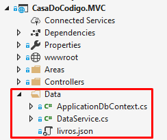
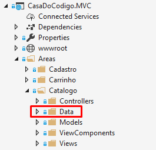

# 4) Isolando Contextos

## Vídeo 4.1 - Criando um Novo Contexto

### Por que isolar contextos?

Atualmente, os arquivos de dados e de contexto do Entity Framework Core da aplicação da Casa do Código estão todos contidos na pasta _**\Data**_ do projeto.



Como discutimos no início deste curso, as mudanças que estamos realizando visam permitir que as alterações feitas em uma única área da aplicação não afetem os demais módulos. Isso requer também o isolamento de bancos de dados. 

Como estamos separando vários aspectos do catálogo em uma área dedicada, vamos começar a mover também os dados e o código necessário para a criação de banco de dados, tabelas e dados iniciais do catálogo de produtos para a pasta /Areas/Catalogo/Data.



Desejamos, no final desta aula, ter dois bancos de dados de negócios: a base de dados atual, CasaDoCodigo, e um novo banco de dados dedicado ao catálogo de produtos (CasaDoCodigo.Catalogo).

### Criando Um Novo Contexto para o Catálogo

Atualmente temos apenas uma classe para o contexto do EF Core para as entidades de negócio da aplicação: `ApplicationDbContext`.

Vamos criar uma nova classe de contexto, só que desta vez ela será dedicada ao catálogo: `CatalogoDbContext`. Essa classe precisa herdar da classe-base `DbContext`.

> arquivo: \CasaDoCodigo\Areas\Catalogo\Data\CatalogoDbContext.cs

```csharp
public class CatalogoDbContext : DbContext
{
    public CatalogoDbContext(DbContextOptions options)
        : base(options)
    {
    }

    protected override void OnModelCreating(ModelBuilder builder)
    {

        base.OnModelCreating(builder);
    }
}
```

> Observação: O construtor `CatalogoDbContext` está usando a versão não-genérica do `DbContextOptions`, mas o uso da versão não-genérica não é recomendado para aplicativos com vários tipos de contexto.

Vamos trocar o tipo do parâmetro `DbContextOptions` por `DbContextOptions<CatalogoDbContext>`.

```csharp
    public CatalogoDbContext(DbContextOptions<CatalogoDbContext> options)
        : base(options)
    {
    }
}
```

De forma similar à classe de contexto antiga, a nova classe de contexto de catálogo precisa definir quais entidades fazem parte do contexto. Porém, Não vamos incluir todas as entidades, mas somente aquelas que fazem sentido para o "domínio" do catálogo: as entidades Categoria e Produto.

> O domínio do catálogo engloba apenas as entidades que estão envolvidas no "problema do Catálogo", ou seja: definir quais produtos (e categorias) podem ser usados na aplicação de comércio eletrônico da Casa do Código. 

Assim, o método OnModelCreating precisa definir apenas as entidades `Categoria` e `Produto`.

Por enquanto, vamos referenciar as mesmas classes `Categoria` e `Produto` que já são usadas no contexto original.

```csharp
protected override void OnModelCreating(ModelBuilder builder)
{
    base.OnModelCreating(builder);

    builder.Entity<Categoria>(b =>
    {
        b.HasKey(t => t.Id);
    });

    builder.Entity<Produto>(b =>
    {
        b.HasKey(t => t.Id);
    });
}
```

## Vídeo 4.2 - Obtendo Dados Iniciais

Agora precisamos popular tanto a nova tabela de categorias quanto a tabela de produtos. Já estamos fazendo isso para o banco de dados original, porém desta vez vamos preencher as categorias e produtos de um jeito diferente.

Até agora, estávamos preenchendo a tabela de produtos com o algoritmo do método `DataService.InicializaDBAsync()`:

```csharp
public async Task InicializaDBAsync(IServiceProvider provider)
{
	.
	.
	.
    List<Livro> livros = await GetLivrosAsync();

    var produtoRepository = provider.GetService<IProdutoRepository>();
    await produtoRepository.SaveProdutosAsync(livros);
}
```

Esse código funciona para os nossos propósitos aqui no curso, mas ele é muito trabalhoso e complexo. Note que precisamos instanciar um objeto da classe `DataService` e também um objeto `IProdutoRepository`.

Vamos fazer algo diferente desta vez. Vamos copiar para nossa classe CatalogoDbContext o método `GetLivros()`:

```csharp
private List<Livro> GetLivros()
{
    var json = File.ReadAllText("data/livros.json");
    return JsonConvert.DeserializeObject<List<Livro>>(json);
}
```

Agora vamos criar um método para obter os objetos de produtos com suas respectivas categorias:

O método `GetProdutos()` deve retornar uma coleção de produtos (`IEnumerable<Produto>`) a partir da lista de livros lida do arquvio livros.json:

```csharp
private IEnumerable<Produto> GetProdutos()
{
    var livros = GetLivros();
}
```

Mas a lista de livros precisa ser convertida em Categorias e Produtos. Primeiro vamos extrair somente os nomes de categorias e montar uma lista de objetos Categoria.

```csharp
private IEnumerable<Produto> GetProdutos()
{
    var livros = GetLivros();

    var categorias = livros
            .Select((l) => l.Categoria)
            .Distinct();
}
```

> Note que o método `Distinct` acima elimina as duplicações de categorias.

> Para maiores detalhes sobre consultas com Entity Framework, confira o ótimo curso de Entity Framework Core do Daniel Portugal aqui na Alura! https://www.alura.com.br/curso-online-entity-framework-core

Agora vamos usar a cláusula `Select()` para realizar a "projeção", que é o termo usado para transformar dados. Neste caso, vamos transformar uma string (com nome da categoria) em um um objeto Categoria.

Vamos retornar uma nova instância de Categoria a partir do seu nome:

```csharp
private IEnumerable<Produto> GetProdutos()
{
    var livros = GetLivros();

    var categorias = livros
            .Select((l) => l.Categoria)
            .Distinct()
            .Select((nomeCategoria) =>
            {
                return Categoria(nomeCategoria);
			 );
}
```

Porém, também precisamos fornecer o Id da categoria, que precisa ser sequencial. Felizmente, o método `Select()` permite passar um segundo parâmetro contento um índice,que pode ser usado para gerar o ID: 

```csharp
private IEnumerable<Produto> GetProdutos()
{
    var livros = GetLivros();

    var categorias = livros
            .Select((l) => l.Categoria)
            .Distinct()
            .Select((nomeCategoria, i) =>
            {
                var c = new Categoria(nomeCategoria);
                c.Id = i + 1;
                return c; });
}
```

Agora que temos as categorias, vamos gerar os produtos, novamente a partir de uma consulta LinQ feita entre livros e categorias:

```csharp
private IEnumerable<Produto> GetProdutos()
{
    var livros = GetLivros();

    var categorias = livros
            .Select((l) => l.Categoria)
            .Distinct()
            .Select((nomeCategoria, i) =>
            {
                var c = new Categoria(nomeCategoria);
                c.Id = i + 1;
                return c; });

    var produtos =
        (from livro in livros
        join categoria in categorias
            on livro.Categoria equals categoria.Nome)

    return produtos;
}
```

A cláusula join acima "liga" livro e categoria a partir do nome desta. 

Agora vamos gerar os objetos produtos:

```csharp
private IEnumerable<Produto> GetProdutos()
{
    var livros = GetLivros();

    var categorias = livros
            .Select((l) => l.Categoria)
            .Distinct()
            .Select((nomeCategoria, i) =>
            {
                var c = new Categoria(nomeCategoria);
                c.Id = i + 1;
                return c; });

    var produtos =
        (from livro in livros
        join categoria in categorias
            on livro.Categoria equals categoria.Nome
        select new Produto(livro.Codigo, livro.Nome, livro.Preco, categoria))
        .ToList();

    return produtos;
}
```

Novamente, o método Select vai nos ajudar a gerar os IDs sequencias de produtos:

```csharp
private IEnumerable<Produto> GetProdutos()
{
    var livros = GetLivros();

    var categorias = livros
            .Select((l) => l.Categoria)
            .Distinct()
            .Select((nomeCategoria, i) =>
            {
                var c = new Categoria(nomeCategoria);
                c.Id = i + 1;
                return c; });

    var produtos =
        (from livro in livros
        join categoria in categorias
            on livro.Categoria equals categoria.Nome
        select new Produto(livro.Codigo, livro.Nome, livro.Preco, categoria))
        .Select((p, i) =>
            {
                p.Id = i + 1;
                return p;
            })
        .ToList();

    return produtos;
}
```

Agora Vamos obter os produtos invocando GetProdutos() a partir do método OnModelCreating:


```csharp
protected override void OnModelCreating(ModelBuilder builder)
{
    base.OnModelCreating(builder);

    var produtos = GetProdutos();
.
.
.
}
```

As categorias podem ser obtidas a partir da mesma lista de produtos, bastando gerar uma lista de objetos Categoria distintos:

```csharp
protected override void OnModelCreating(ModelBuilder builder)
{

    base.OnModelCreating(builder);

    var produtos = GetProdutos();
    var categorias =
        produtos.Select(p => p.Categoria).Distinct();
.
.
.
}
```

## Vídeo 4.3 - Propagação de Dados

Agora vamos começar a inserir esses dados de produtos e categorias no banco de dados.

O nome do procedimento de criar os dados iniciais é **propagação de dados**, ou **data seeding** em inglês.

Felizmente, a partir da versão 2.1 do EF Core, podemos contar com um novo método `HasData()` da classe `DataBuilder` para propagar os dados iniciais de produtos/categorias:

```csharp
protected override void OnModelCreating(ModelBuilder builder)
{

    base.OnModelCreating(builder);

    var produtos = GetProdutos();
    var categorias =
        produtos.Select(p => p.Categoria).Distinct();

    builder.Entity<Categoria>(b =>
    {
        b.HasKey(t => t.Id);
        b.HasData(categorias);
    });

    builder.Entity<Produto>(b =>
    {
        b.HasKey(t => t.Id);
    });
}
```

Note acima como foi fácil usar o método `HasData()`.

Agora, vamos fazer usar `HasData()` para inserir produtos iniciais. Desta vez, também precisamos associar o Id da categoria de cada produto:

```csharp
protected override void OnModelCreating(ModelBuilder builder)
{

    base.OnModelCreating(builder);

    var produtos = GetProdutos();
    var categorias =
        produtos.Select(p => p.Categoria).Distinct();

    builder.Entity<Categoria>(b =>
    {
        b.HasKey(t => t.Id);
        b.HasData(categorias);
    });

    builder.Entity<Produto>(b =>
    {
        b.HasKey(t => t.Id);
        b.HasData(
        produtos.Select(p =>
                new
                {
                    p.Id,
                    p.Codigo,
                    p.Nome,
                    p.Preco,
                    CategoriaId = p.Categoria.Id
                }
            ));
    });
}
```

## Vídeo 4.4 - Criando um Novo Banco de Dados

Ainda falta instruir a nossa aplicação para utilizar esse novo contexo de catálogo. Vamos fazer isso modificando o arquivo de configuração `appsettings.json` para inserir uma nova string de conexão para um banco de dados específico para o catálogo:

> arquivo: \CasaDoCodigo\appsettings.json

```json
"Catalogo": "Data Source=(localdb)\\MSSQLLocalDB;Initial Catalog=CasaDoCodigo.Catalogo;Integrated Security=True;Connect Timeout=30;Encrypt=False;TrustServerCertificate=True;ApplicationIntent=ReadWrite;MultiSubnetFailover=False",
```

Agora modificamos a classe Startup para configurar o novo contexto CatalogoDbContext no "pipeline" da aplicação:

### Configurando o Novo Contexto

> arquivo: \Item04\CasaDoCodigo\Startup.cs

```csharp
ConfigurarContexto<ApplicationContext>(services, "Default");       
ConfigurarContexto<CatalogoDbContext>(services, "Catalogo");
```


### Criando e Aplicando a Migração

Agora vamos criar uma nova migração, explicitando o nome da classe do novo contexto e definindo a pasta que irá conter as migrações (Areas/Catalogo/Data/):

> PM> Add-Migration "AreaCatalogo" -Context CatalogoDbContext -o "Areas/Catalogo/Data/Migrations"

Basta agora rodar a atualização para criar o banco de dados de catálogo com o novo modelo. Novamente, vamos explicitar o nome da classe de contexto.

> PM> Update-Database -verbose -Context CatalogoDbContext 


### Conferindo o Novo Banco de Dados

Bom, agora vamos abrir o menu View > SQL Server Object Explorer para verificar a nova base de dados de catálogo, suas tabelas e colunas geradas a partir da migração:


Como podemos ver, além do banco de dados CasaDoCodigo, agora temos também o novo banco de dados CasaDoCodigo.Catalogo, contendo apenas as tabelas `Produto` e `Categoria`. Essas tabelas fazem parte de ambos os bancos de dados. Esse tipo de duplicação pode parecer ruim, mas na verdade esse tipo de separação permite que que a base de dados da área de Catálogo possa evoluir de forma independente das demais áreas. A ideia é que as modificações no banco de dados do Catalogo não afetem outros bancos de dados.

Na próxima aula veremos como isolar também o modelo do catálogo, que funcionará de forma independente dos modelos das outras áreas da aplicação.