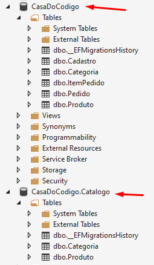

# 4) Isolando Contextos

## Criando Um Novo Contexto para o Catálogo

> arquivo: \CasaDoCodigo\Areas\Catalogo\Data\CatalogoDbContext.cs

```csharp
public class CatalogoDbContext : DbContext
{
    public CatalogoDbContext(DbContextOptions options)
        : base(options)
    {
    }

    protected override void OnModelCreating(ModelBuilder builder)
    {

        base.OnModelCreating(builder);
    }
}
```

## Trabalhando Com Mais de Um Contexto por Aplicação

```csharp
    public CatalogoDbContext(DbContextOptions<CatalogoDbContext> options)
        : base(options)
    {
    }
}
```

```csharp
protected override void OnModelCreating(ModelBuilder builder)
{

    base.OnModelCreating(builder);

    builder.Entity<Categoria>(b =>
    {
        b.HasKey(t => t.Id);
    });

    builder.Entity<Produto>(b =>
    {
        b.HasKey(t => t.Id);
    });
    builder.Entity<Produto>();
}
```

```csharp
protected override void OnModelCreating(ModelBuilder builder)
{

    base.OnModelCreating(builder);

    var produtos = GetProdutos();

    builder.Entity<Categoria>(b =>
    {
        b.HasKey(t => t.Id);
    });

    builder.Entity<Produto>(b =>
    {
        b.HasKey(t => t.Id);
    });
    builder.Entity<Produto>();
}
```

```csharp
protected override void OnModelCreating(ModelBuilder builder)
{

    base.OnModelCreating(builder);

    var produtos = GetProdutos();
    var categorias =
        produtos.Select(p => p.Categoria).Distinct();

    builder.Entity<Categoria>(b =>
    {
        b.HasKey(t => t.Id);
    });

    builder.Entity<Produto>(b =>
    {
        b.HasKey(t => t.Id);
    });
    builder.Entity<Produto>();
}
```

```csharp
protected override void OnModelCreating(ModelBuilder builder)
{

    base.OnModelCreating(builder);

    var produtos = GetProdutos();
    var categorias =
        produtos.Select(p => p.Categoria).Distinct();

    builder.Entity<Categoria>(b =>
    {
        b.HasKey(t => t.Id);
        b.HasData(categorias);
    });

    builder.Entity<Produto>(b =>
    {
        b.HasKey(t => t.Id);
        b.HasData(
        produtos.Select(p =>
                new
                {
                    p.Id,
                    p.Codigo,
                    p.Nome,
                    p.Preco,
                    CategoriaId = p.Categoria.Id
                }
            ));
    });
    builder.Entity<Produto>();
}
```

```csharp
protected override void OnModelCreating(ModelBuilder builder)
{

    base.OnModelCreating(builder);

    var produtos = GetProdutos();
    var categorias =
        produtos.Select(p => p.Categoria).Distinct();

    builder.Entity<Categoria>(b =>
    {
        b.HasKey(t => t.Id);
        b.HasData(categorias);
    });

    builder.Entity<Produto>(b =>
    {
        b.HasKey(t => t.Id);
        b.HasData(
        produtos.Select(p =>
                new
                {
                    p.Id,
                    p.Codigo,
                    p.Nome,
                    p.Preco,
                    CategoriaId = p.Categoria.Id
                }
            ));
    });
    builder.Entity<Produto>();
}
```


## Obtendo Produtos a Partir do Arquivo JSON

```csharp
private List<Livro> GetLivros()
{
    var json = File.ReadAllText("livros.json");
    return JsonConvert.DeserializeObject<List<Livro>>(json);
}

public class Livro
{
	public string Codigo { get; set; }
	public string Nome { get; set; }
	public string Categoria { get; set; }
	public string Subcategoria { get; set; }
	public decimal Preco { get; set; }
}
```

## Propagando Dados Iniciais do Catálogo


> arquivo: \CasaDoCodigo\Areas\Catalogo\Data\CatalogoDbContext.cs

```csharp
public class CatalogoDbContext : DbContext
{
    public CatalogoDbContext(DbContextOptions<CatalogoDbContext> options)
        : base(options)
    {
    }

    protected override void OnModelCreating(ModelBuilder builder)
    {

        base.OnModelCreating(builder);

        var produtos = GetProdutos();
        var categorias =
            produtos.Select(p => p.Categoria).Distinct();

        builder.Entity<Categoria>(b =>
        {
            b.HasKey(t => t.Id);
            b.HasData(categorias);
        });

        builder.Entity<Produto>(b =>
        {
            b.HasKey(t => t.Id);
            b.HasData(
            produtos.Select(p =>
                    new
                    {
                        p.Id,
                        p.Codigo,
                        p.Nome,
                        p.Preco,
                        CategoriaId = p.Categoria.Id
                    }
                ));
        });
        builder.Entity<Produto>();
    }

    private IEnumerable<Produto> GetProdutos()
    {
        var livros = GetLivros();

        var categorias = livros
                .Select((l) => l.Categoria)
                .Distinct()
                .Select((nomeCategoria, i) =>
                {
                    var c = new Categoria(nomeCategoria);
                    c.Id = i + 1;
                    return c; });

        var produtos =
            (from livro in livros
            join categoria in categorias
                on livro.Categoria equals categoria.Nome
            select new Produto(livro.Codigo, livro.Nome, livro.Preco, categoria))
            .Select((p, i) =>
                {
                    p.Id = i + 1;
                    return p;
                })
            .ToList();

        return produtos;
    }

    private List<Livro> GetLivros()
    {
        var json = File.ReadAllText("livros.json");
        return JsonConvert.DeserializeObject<List<Livro>>(json);
    }
}

public class Livro
{
    public string Codigo { get; set; }
    public string Nome { get; set; }
    public string Categoria { get; set; }
    public string Subcategoria { get; set; }
    public decimal Preco { get; set; }
}
```

```csharp
private IEnumerable<Produto> GetProdutos()
{
    var livros = GetLivros();

    var categorias = livros
            .Select((l) => l.Categoria)
            .Distinct()
            .Select((nomeCategoria, i) =>
            {
                var c = new Categoria(nomeCategoria);
                c.Id = i + 1;
                return c; });

    var produtos =
        (from livro in livros
        join categoria in categorias
            on livro.Categoria equals categoria.Nome
        select new Produto(livro.Codigo, livro.Nome, livro.Preco, categoria))
        .Select((p, i) =>
            {
                p.Id = i + 1;
                return p;
            })
        .ToList();

    return produtos;
}
```

## Categorias Comparáveis

> arquivo: \CasaDoCodigo\Models\BaseModel.cs

```csharp
public abstract class BaseModel : IComparable

public int CompareTo(object obj)
{
    if (!(obj is BaseModel outro)) return 1;

    return Id.CompareTo(outro.Id);
}

public override bool Equals(object obj)
{
    return obj is BaseModel model &&
            Id == model.Id;
}

public override int GetHashCode()
{
    return HashCode.Combine(Id);
}
```

> arquivo: \CasaDoCodigo\Models\Produto.cs

```csharp
public int? CategoriaId { get; private set; }

public Produto(int id, string codigo, string nome, decimal preco, Categoria categoria) 
    : this(codigo, nome, preco, categoria)
{
    Id = id;
}
```

## Configurando o Novo Contexto

> arquivo: \Item04\CasaDoCodigo\Startup.cs

```csharp
string connectionString = Configuration.GetConnectionString("Default");

-services .AddDbContext
<ApplicationContext>(options =>
-options.UseSqlServer(connectionString)
);

+ConfigurarContexto<ApplicationContext>(services, "Default");       
+ConfigurarContexto<CatalogoDbContext>(services, "Catalogo");

private void ConfigurarContexto<T>(IServiceCollection services, string nomeConexao) where T: DbContext
{
    string connectionString = Configuration.GetConnectionString(nomeConexao);

    services.AddDbContext<T>(options =>
        options.UseSqlServer(connectionString)
    );
}
```

> arquivo: \CasaDoCodigo\appsettings.json

```json
"Catalogo": "Data Source=(localdb)\\MSSQLLocalDB;Initial Catalog=CasaDoCodigo.Catalogo;Integrated Security=True;Connect Timeout=30;Encrypt=False;TrustServerCertificate=True;ApplicationIntent=ReadWrite;MultiSubnetFailover=False",
```

## Criando e Aplicando a Migração

> PM> Add-Migration "AreaCatalogo" -Context CatalogoDbContext -o "Areas/Catalogo/Data/Migrations"

> PM> Update-Database -verbose -Context CatalogoDbContext 

## Conferindo o Novo Banco de Dados

