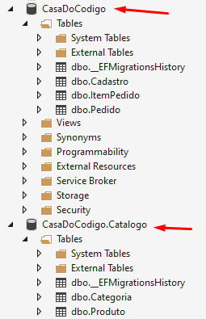

# 5) Modelos Delimitados

## Vídeo 5.1 - Novo Modelos de Catálogo

Na última aula, além do banco de dados CasaDoCodigo, passamos a contar também com o novo banco de dados CasaDoCodigo.Catalogo, contendo apenas as tabelas `Produto` e `Categoria`. Essas tabelas agora existem em ambos os bancos de dados. Esse tipo de duplicação pode parecer ruim, mas na verdade esse tipo de separação permite que que a base de dados da área de Catálogo possa evoluir de forma independente das demais áreas. A ideia é que as modificações no banco de dados do Catalogo não afetem outros bancos de dados.

Nesta aula veremos como isolar também o modelo do catálogo, que funcionará de forma independente dos modelos das outras áreas da aplicação.

Vamos copiar as classes do modelo da pasta /Models/ para a nova pasta /Areas/Catalogo/Models :

### Classes copiadas para Área de Catálogo

*** Arquivos:
* \Areas\Catalogo\Data\Repositories\BaseRepository.cs
* \Areas\Catalogo\Data\Repositories\ProdutoRepository.cs
* \Areas\Catalogo\Models\BaseModel.cs
* \Areas\Catalogo\Models\Categoria.cs
* \Areas\Catalogo\Models\Produto.cs

Com essa mudança, as classes e views da área de Catalogo precisam referenciar (isto é, apontar para) as novas classes do modelo da área:

### Mudar o namespace de CasaDoCodigo.Models para CasaDoCodigo.Areas.Catalogo.Models

**Arquivos:**
* \Areas\Catalogo\Models\ViewModels\BuscaProdutosViewModel.cs
* \Areas\Catalogo\Models\ViewModels\CarrosselPaginaViewModel.cs
* \Areas\Catalogo\Models\ViewModels\CarrosselViewModel.cs
* \Areas\Catalogo\Models\ViewModels\CategoriasViewModel.cs
* \Areas\Catalogo\ViewComponents\CarrosselPaginaViewComponent.cs
* \Areas\Catalogo\ViewComponents\CarrosselViewComponent.cs
* \Areas\Catalogo\ViewComponents\CategoriasViewComponent.cs
* \Areas\Catalogo\Views\Home\_NavegacaoCarrossel.cshtml
* \Areas\Catalogo\Views\Home\_ProdutoCard.cshtml
* \Areas\Catalogo\Views\Home\Index.cshtml
* \Areas\Catalogo\Views\Home\_FormularioBusca.cshtml
* \Areas\Catalogo\Views\Home\Components\ProdutoCard\Default.cshtml

```csharp
using CasaDoCodigo.Areas.Catalogo.Models;
```

## Vídeo 5.2 - Configurando o Novo Repositório de Produtos

Outra mudança é na classe base de repositório. Vamos ter que mudar a classe do contexto de ApplicationDbContext para CatalogoDbContext, para que o repositório de produtos da área de Catálogo possa acessar o banco de dados a partir do contexto da própria área de catálogo.

### Mudar a classe do contexto de ApplicationDbContext para CatalogoDbContext

\Areas\Catalogo\Data\Repositories\BaseRepository.cs
```csharp
public abstract class BaseRepository<T> where T : BaseModel
{
    protected readonly IConfiguration configuration;
    protected readonly CatalogoDbContext contexto;
    protected readonly DbSet<T> dbSet;

    public BaseRepository(IConfiguration configuration,
        CatalogoDbContext contexto)
    {
        this.configuration = configuration;
        this.contexto = contexto;
        dbSet = contexto.Set<T>();
    }
}
```

Agora vamos mudar também o namespace da classe de repositório acessada pelo controller MVC da área de catálogo, apontando para o repositório da área:

### Mudar o namespace de CasaDoCodigo.Data.Repositories para CasaDoCodigo.Areas.Catalogo.Data.Repositories

\Areas\Catalogo\Controllers\HomeController.cs
```csharp
using CasaDoCodigo.Areas.Catalogo.Data.Repositories;
```

Por último, vamos modificar a classe `Startup` do projeto, para configurar a injeção de dependência para ambas as classes de repositório de produtos: tanto a classe `ProdutoRepository` que atende a aplicação como um todo quanto a classe `ProdutoRepository` que atende somente a área de Catálogo.

### Registrando Injeção de Dependência para 2 Repositórios de Produtos

**Arquivo: \Startup.cs**

```csharp
services.AddTransient<Repositories.IProdutoRepository
, Repositories.ProdutoRepository>();
 
services.AddTransient<Areas.Catalogo.Data.Repositories.IProdutoRepository
, Areas.Catalogo.Data.Repositories.ProdutoRepository>();
```

Note quem ambas as classes `ProdutoRepository` foram registradas como *transientes* (temporária), isto é, tal como explicamos no início desta sequência de cursos, cada vez que um objeto transiente (temporário) é requisitada por um objeto, uma nova instância é automaticamente criada.

## Vídeo 5.3 - Removendo produto e categoria do Modelo Principal

Podemos demonstrar como os modelos diferentes podem conviver em harmonia dentro da nossa aplicação.

A partir de agora, vamos começar a lidar com as entidades categoria e produto apenas na área de catálogo. Ao mesmo tempo, vamos modificar o modelo geral da aplicação (que está fora da área de catálogo) para remover as entidades de produto e categoria.

Remova os arquivos:

- \Models\Produto.cs
- \Models\Categoria.cs

> arquivo: \Models\ItemPedido.cs


Porém, o que vamos fazer com o ItemPedido, que depende da entidade Produto? Vamos substituir a referência ao objeto `Produto` por dois campos: `ProdutoCodigo` e `ProdutoNome`.

Substituir:

```csharp
public Produto Produto { get; private set; }
```

Por:

```csharp
public string ProdutoCodigo { get; private set; }
[Required]
[DataMember]
public string ProdutoNome { get; private set; }
```

Além disso, temos que modificar o construtor da classe `ItemPedido`:

Substituir:

```csharp
public ItemPedido(Pedido pedido, Produto produto, int quantidade, decimal precoUnitario)
```

Por:

```csharp
public ItemPedido(Pedido pedido, string produtoCodigo, string produtoNome, int quantidade, decimal precoUnitario)
```

Substituir:

```csharp
Produto = produto;
```

Por:

```csharp
ProdutoCodigo = produtoCodigo;
ProdutoNome = produtoNome;
```

Agora vamos modificar o contexto EF Core principal da aplicação (ApplicationDbContext) para eliminar as 2 entidades Categoria e Produto que foram removidas do modelo:

> arquivo: \ApplicationDbContext.cs

Vamos remover estas 3 linhas:

```csharp
modelBuilder.Entity<Categoria>().HasKey(t => t.Id);
modelBuilder.Entity<Produto>().HasKey(t => t.Id);
.
.
.
modelBuilder.Entity<ItemPedido>().HasOne(t => t.Produto);
```

Vamos aproveitar para remover também a propagação (seeding) automática da tabela de produtos, que é feita no final da classe Startup:

> arquivo: \Startup.cs

remover:

```csharp
var dataService = serviceProvider.GetRequiredService<IDataService>();
dataService.InicializaDBAsync(serviceProvider).Wait();
```


### Vídeo 5.4 : Atualizar as views

Nossas views das áreas de Carrinho e de Pedido estão apontando para o código e o nome do objeto `Produto` através do objeto `ItemPedido`. Como este não possui mais uma referência para o `Produto`, vamos acessar diretamente as propriedades `ProdutoCodigo` e `ProdutoNome` do `ItemPedido`:  

> arquivo: \Areas\Carrinho\Views\Home\Index.cshtml

substituir:

```razor

```

por

```razor

```

substituir:

```razor
<div class="col-md-3">@(item.Produto.Nome)</div>
```

por 

```razor
<div class="col-md-3">@(item.ProdutoNome)</div>
```

> arquivo: \Areas\Pedido\Views\Home\Index.cshtml

substituir:

```razor
<div>@item.Produto.Nome</div>
```

por 

```razor
<div>@item.ProdutoNome</div>
```


## Vídeo 5.5 : Adaptando o repositório de Pedido

Como as entidades Categorias e Produtos não estão mais no modelo principal, o repositório PedidoRepository terá que acessar produtos através da classe `ProdutoRepository`. 
 
> arquivo: \Repositories\PedidoRepository.cs

Incluir o campo, parâmetro e inicialização para o repositório de produtos:

```csharp
private readonly IProdutoRepository produtoRepository;
```

substituir:

```csharp
var produto = await
    contexto.Set<Produto>()
    .Where(p => p.Codigo == codigo)
    .SingleOrDefaultAsync();
```

por:

```csharp
var produto = await produtoRepository.GetProdutoAsync(codigo);
```

substituir:

```csharp
	.Where(i => i.Produto.Codigo == codigo
```

por:

```csharp
	.Where(i => i.ProdutoCodigo == codigo
```

substituir:

```csharp
itemPedido = new ItemPedido(pedido, produto, 1, produto.Preco);
```
por:

```csharp
itemPedido = new ItemPedido(pedido, produto.Codigo, produto.Nome, 1, produto.Preco);
```


remover:

```csharp
	.ThenInclude(i => i.Produto)
	.ThenInclude(prod => prod.Categoria)
```

> arquivo: \Startup.cs

remover:

```csharp
services.AddTransient<Repositories.IProdutoRepository, Repositories.ProdutoRepository>();
services.AddTransient<Areas.Catalogo.Data.Repositories.IProdutoRepository, Areas.Catalogo.Data.Repositories.ProdutoRepository>();
```

adicionar:

```csharp
services.AddTransient<IProdutoRepository, ProdutoRepository>();
```


Agora vamos Criar uma migração para remover as tabelas Produtos e Categorias do banco de dados principal da aplicação (CasaDoCodigo). Com isso, apenas o banco de dados CasaDoCodigo.Catalogo conterá tais tabelas.

>PM> Add-Migration

Essa migração se chamará "ModeloSemProduto"...

>PM> Add-Migration "ModeloSemProduto"

... e afetará apenas o contexto principal ApplicationDbContext

>PM> Add-Migration "ModeloSemProduto" -Context ApplicationDbContext

Criando essa migração, agora podemos rodar o comando para aplicar as alterações do modelo no banco de dados, com o método Update-Database...

>PM> Update-Database -verbose

... afetando apenas o contexto principal ApplicationDbContext

>PM> Update-Database -verbose -Context ApplicationDbContext 

Podemos verifiar agora na janela do SQL Server Object Explorer que essa migração removeu com sucesso as tabelas Categorias e Produtos do banco de dados principal da aplicação:



Esse isolamento de modelos é um conceito mais conhecido como Modelos Delimitados ou Bounded Contexts. É um conceito usado em DDD (Domain Driven Design) que sugere separar o domínio da aplicação um diferentes subdomínios, um para cada área de negócios, de forma semelhante ao que fizemos nestas duas últimas aulas.

Para saber mais sobre DDD e Modelos Delimitados, dê uma olhada neste artigo do InfoQ:

https://www.infoq.com/br/news/2019/07/bounded-context-eric-evans/