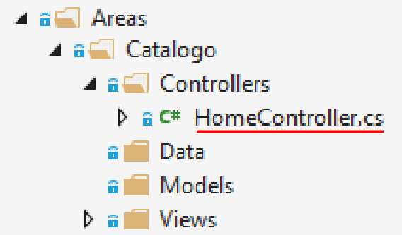
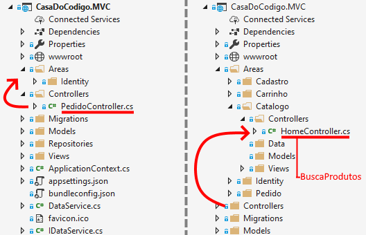

# ASP.NET Core Parte 5
## Modularização e Componentização

### Introdução

A programação modular é um dos padrões de design, que divide os projetos em vários módulos com base em recursos e considera os módulos como projetos separados.

Neste curso abordaremos um Projeto Inicial de uma aplicação de comércio eletrônico, que passará por um processo progressivo de modularização e componentização. Iremos aprender a criar Áreas, Views Parciais, Componentes Visuais e Isolamento de Contextos e de modelos.

# 1) Areas

## Vídeo 1.1: Modularização com ASP.NET Core

#### O Projeto Inicial

Para começar este curso, trabalharemos com um projeto de loja virtual da editora Casa do Código. Esse projeto contém as funcionalidades:

1. login/registro de novo usuário 
2. catálogo de produtos
3. carrinho de compras
4. cadastro de usuário
5. checkout (fechamento de pedido)

O projeto inicial funciona perfeitamente. Porém, quando olhamos a estrutura do projeto, notamos apenas 1 controller para lidar com toda a aplicação. Além disso, todas as views estão misturadas numa mesma pasta do projeto:


Da mesma forma, os modelos também estão misturados na mesma pasta Models:


Claramente, nosso projeto carece de uma boa organização, e sem ela pode ser mais difícil desenvolver novas funcionalidades. Essa falta de organização dificulta futuras mudanças e expansões no projeto, pois não existe nenhum módulo ou separação clara entre as diferentes áreas da aplicação

#### Nova área: Catalogo

Para melhorar a organização do código, o ASP.NET Core possui o conceito de **Area**. Áreas são um recurso do ASP.NET Core usado para organizar funcionalidades relacionadas em um grupo. 
Vamos demonstrar a criação de uma nova área em nosso projeto através de um processo de ***scaffolding***. Essa área vai conter as funcionalidades do catálogo de produtos.

Para criar uma nova área, clique com o botão direito sobre o nome do projeto, e escolha ***Add > Area***:


A seguir, preencha o nome da área "Catalogo".


Pronto, agora temos uma nova subpasta **Catalogo** dentro da pasta **Areas**.


Agora temos novas pastas no projeto, que podem ser usadas na organização e modularização da aplicação:

- Areas
	- Catalogo
     	- Controllers
       	- Data
       	- Models
       	- Views


#### Benefícios da programação modular

Você pode ter percebido que essas pastas sugerem que os controllers, modelos, views e dados de catálogo sejam mantidos de forma isolada em relação ao resto da aplicação. Vamos fazer essas mudanças progressivamente ao longo deste curso.

Vejamos os benefícios da programação modular:

- Desenvolvimento rápido
  - Trabalhar em todos os módulos simultaneamente por diferentes equipes ou membros reduzirá o tempo de conclusão.
- A base de código facilmente gerenciável
  - Codebase será gerenciado sem qualquer aborrecimento.
- Solução de problemas fácil
  - A resolução de problemas será mais propícia, uma vez que é fornecida uma base de código separada para cada módulo.
- Responsabilidade definida pelas equipes / membros
  - Cada equipe ou membro terá uma responsabilidade precisamente predefinida no projeto.

## Vídeo 1.2 Áreas

A área Catalogo conterá modelos, views e controllers específicos do catálogo de produtos da aplicação.

Vamos começar criando um novo controller dentro da area de Catalogo:



A seguir, copiamos o método `BuscaProdutos()` da classe `PedidoController` para a nova classe `HomeController`, e o renomeamos como `Index()`:




```csharp
[Area("Catalogo")]
public class HomeController : Controller
{
    // GET: /<controller>/
    public async Task<IActionResult> Index(string pesquisa)
    {
        return View(await produtoRepository.GetProdutosAsync(pesquisa));
    }
}
```

Porém, o novo método `Index` acima depende de `produtoRepository`, que não existe na classe. Vamos fornecê-lo por injeção de dependência, que será armazenado em um campo privado no construtor da classe:


```csharp
[Area("Catalogo")]
public class HomeController : Controller
{
    private readonly IProdutoRepository produtoRepository;

    public HomeController(IProdutoRepository produtoRepository)
    {
        this.produtoRepository = produtoRepository;
    }
.
.
.
}
```

Agora precisamos definir o `HomeController` como destino de uma nova **rota de área**. Ou seja, sempre que o usuário navegar para **localhost:5101/Catalogo**, ele deverá acessar a action `Index` de `HomeController` dentro da pasta **Areas/Catalogo**. 

Faremos isso 1) decorando o controller com um atributo e também 2) definindo uma rota de área em **Startup.cs**.

1) Vamos decorar o controller com um atributo AreaAttribute. Esse atributo permite que o HomeController esteja acessível para a rota de área de Catalogo.

```csharp
[Area("Catalogo")]
public class HomeController : Controller
```

2) Vamos Adicionar uma rota de área em **Startup.cs** com o método `MapAreaRoute`:

**Startup.cs (código original)**
```csharp
app.UseMvc(routes =>
{
    routes.MapRoute(
        name: "default",
        template: "{controller=Pedido}/{action=BuscaProdutos}/{codigo?}");
});
```

**Startup.cs (código alterado)**
```csharp
app.UseMvc(routes =>
{
	//criando o mapeamento de rota para a área de catálogo
    routes.MapAreaRoute(
        name: "AreaCatalogo",
        areaName: "Catalogo",
        template: "Catalogo/{controller=Home}/{action=Index}/{pesquisa?}");

    routes.MapRoute(
        name: "default",
        template: "{controller=Pedido}/{action=BuscaProdutos}/{codigo?}");
});
```

Graças ao roteamento de área de catálogo, agora, sempre que o usuário navegar para **localhost:5101/Catalogo**, ele irá acessar a action `Index` de `HomeController` dentro da pasta **Areas/Catalogo**.


### Nova área: Carrinho
### Nova área: Cadastro


### Partial Views

Partial views
More Partial Views

### View Components

View Components

### Isolando Contextos

Isolando Contextos

### Modelos Delimitados

Modelos Delimitados

Pós-vídeo: removendo produto e categoria do contexto principal da apl… 

### Conclusão


