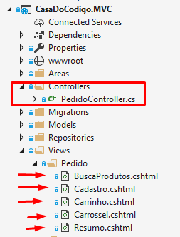
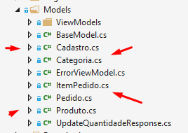
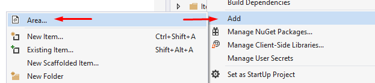
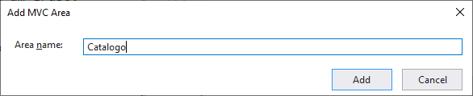
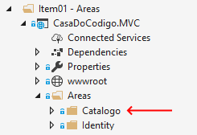

# ASP.NET Core Parte 5
## Modularização e Componentização

### Introdução

A programação modular é um dos padrões de design, que divide os projetos em vários módulos com base em recursos e considera os módulos como projetos separados.

Neste curso abordaremos um Projeto Inicial de uma aplicação de comércio eletrônico, que passará por um processo progressivo de modularização e componentização. Iremos aprender a criar Áreas, Views Parciais, Componentes Visuais e Isolamento de Contextos e de modelos.

# 1) Areas

### O Projeto Inicial

Para começar este curso, trabalharemos com um projeto de loja virtual da editora Casa do Código. Esse projeto contém as funcionalidades:

1. login/registro de novo usuário 
2. catálogo de produtos
3. carrinho de compras
4. cadastro de usuário
5. checkout (fechamento de pedido)

O projeto inicial funciona perfeitamente. Porém, temos apenas 1 controller para lidar com toda a aplicação. Além disso, todas as views estão misturadas numa mesma pasta do projeto:

Da mesma forma, os modelos também estão misturados na mesma pasta Models:

Claramente, nosso projeto carece de uma boa organização, o que pode dificultar o desenvolvimento de novas funcionalidades. Essa falta de organização dificulta futuras mudanças e expansões no projeto, pois não existe nenhum módulo ou separação clara entre as diferentes áreas da aplicação

Para melhorar a organização do código, o ASP.NET Core possui o conceito de **Area**. Áreas são um recurso do ASP.NET Core usado para organizar funcionalidades relacionadas em um grupo. 

Vamos demonstrar a criação de uma nova área em nosso projeto. Essa área vai conter as funcionalidades do catálogo de produtos.

Para criar uma nova área, clique com o botão direito sobre o nome do projeto, e escolha ***Add > Area***:

A seguir, preencha o nome da área "Catalogo".

Pronto, agora temos uma nova subpasta **Catalogo** dentro da pasta **Areas**.

Nova área: Catalogo
Nova área: Carrinho
Nova área: Cadastro

#### Benefícios da programação modular

- Desenvolvimento rápido
  - Trabalhar em todos os módulos simultaneamente por diferentes equipes ou membros reduzirá o tempo de conclusão.
- A base de código facilmente gerenciável
  - Codebase será gerenciado sem qualquer aborrecimento.
- Solução de problemas fácil
  - A resolução de problemas será mais propícia, uma vez que é fornecida uma base de código separada para cada módulo.
- Responsabilidade definida pelas equipes / membros
  - Cada equipe ou membro terá uma responsabilidade precisamente predefinida no projeto.

### Partial Views

Partial views
More Partial Views

### View Components

View Components

### Isolando Contextos

Isolando Contextos

### Modelos Delimitados

Modelos Delimitados

Pós-vídeo: removendo produto e categoria do contexto principal da apl… 

### Conclusão

